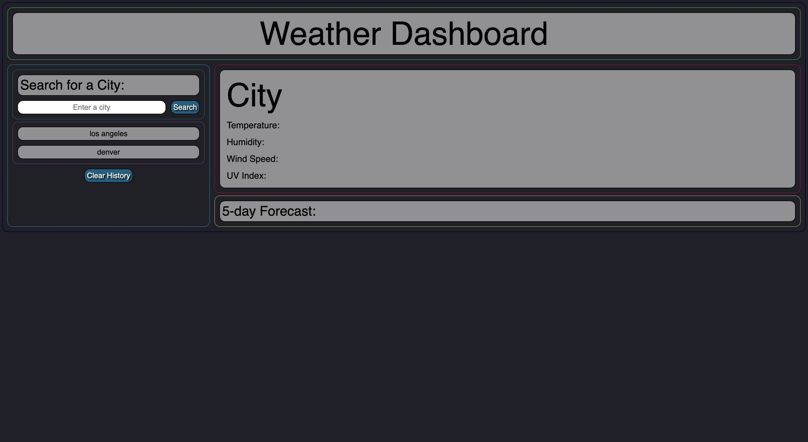

# Weather Dashboard

## Table of Contents
[Project Link](#Link)  
[Technologies](#Technologies)  
[Description](#Description)  
[Screenshots](#Screenshots)  
[License](#License)  
[Contact](#Contact)

## Link
https://dalto135.github.io/weather-dashboard/

## Technologies
HTML, CSS and Javascript

## Description
An application that takes a city name as user input and displays current weather conditions for that city in addition to a five day forecast. The user's search history is saved to localStorage and persists on the page when the page is refreshed. Search history elements are clickable and will again display the weather conditions for that city. Search history can be cleared from localStorage and the page list.

## Screenshots

## License
MIT

## Contact
Dalton Wilkins - wilkins.271@osu.edu
